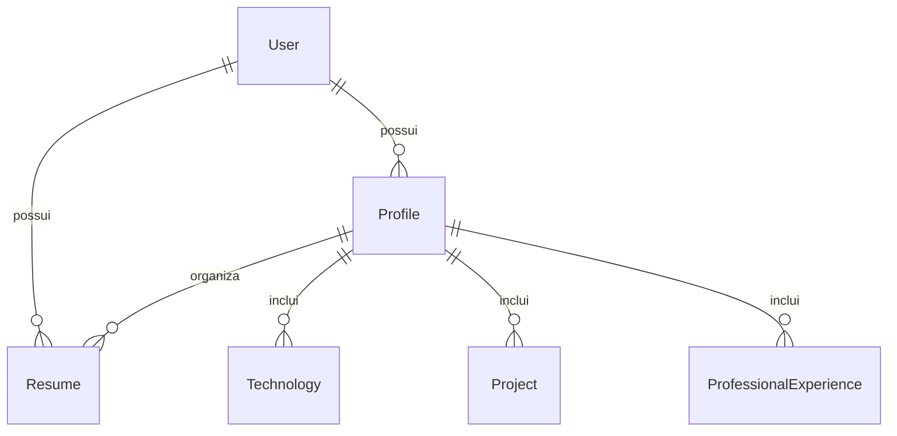

# ProfileSync AI — Arquitetura e Contratos Vigentes

## Visão geral

O ProfileSync AI é uma plataforma para gerenciamento de ativos de conhecimento profissional. Sua arquitetura foi projetada para preservar, organizar e evoluir informações da trajetória profissional do usuário, permitindo que esse conhecimento seja reutilizado em diferentes contextos, como currículos, perfis profissionais, portfólios e futuras integrações.

A plataforma disponibiliza uma API REST desenvolvida com FastAPI para gerenciamento de usuários, perfis, currículos e mecanismos de exportação, utilizando autenticação JWT e arquitetura em camadas. Suporta a geração de representações especializadas dos ativos de conhecimento, incluindo currículos compatíveis com Applicant Tracking Systems (ATS), preservando separação entre o domínio e os mecanismos de exportação.

Os modelos de Inteligência Artificial são considerados componentes de processamento e poderão evoluir ao longo do tempo. O principal ativo da plataforma é o conhecimento estruturado persistido, independente do modelo de IA utilizado.

## Componentes implementados

| Componente     | Responsabilidade                                                                                                                                                                                                                                                                                                                                                                                                                                 |
| -------------- | ------------------------------------------------------------------------------------------------------------------------------------------------------------------------------------------------------------------------------------------------------------------------------------------------------------------------------------------------------------------------------------------------------------------------------------------------ |
| `api/v1`       | Rotas HTTP para autenticação, perfis, currículos, projetos, tecnologias, experiências profissionais, vagas, inteligência de perfil, inteligência de carreira, exportação e validação ATS.                                                                                                                                                                                                                                                        |
| `schemas`      | Contratos Pydantic de entrada e saída da API, incluindo modelos de análise de perfil, análise de carreira, recomendações de impacto e planos de ação.                                                                                                                                                                                                                                                                                            |
| `services`     | Camada de regras de negócio. Implementa autenticação, autorização por usuário, gerenciamento dos ativos profissionais, exportação, validação ATS, análise de perfil (`ProfileIntelligenceService`), análise de carreira (`CareerIntelligenceService`), geração de recomendações de impacto (`ImpactRecommendationService`), extração de requisitos de vagas (`JobRequirementExtractor`) e geração de planos de ação (`CareerActionPlanService`). |
| `repositories` | Persistência dos dados utilizando SQLAlchemy e isolamento do acesso ao banco de dados.                                                                                                                                                                                                                                                                                                                                                           |
| `models`       | Modelos ORM que representam os ativos persistidos da plataforma e seus relacionamentos.                                                                                                                                                                                                                                                                                                                                                          |
| `exporters`    | Transformação dos ativos de conhecimento em formatos externos (Markdown, PDF, DOCX e futuras extensões).                                                                                                                                                                                                                                                                                                                                         |
| `core`         | Configuração da aplicação, autenticação JWT, segurança, controle de acesso, rate limiting, logging e componentes compartilhados.                                                                                                                                                                                                                                                                                                                 |

```text
Cliente HTTP / Frontend
            │
            ▼
      Bearer JWT
            │
            ▼
      API FastAPI
            │
            ▼
 ┌─────────────────────────────┐
 │ Camada de Services          │
 │                             │
 │ • AuthService               │
 │ • ProfileService            │
 │ • ResumeService             │
 │ • JobService                │
 │ • ProfileIntelligenceService│
 │ • CareerIntelligenceService │
 │ • ATSValidationService      │
 └─────────────────────────────┘
            │
            ▼
     Repositories
            │
            ▼
 SQLAlchemy / Banco de Dados
            │
            ▼
     Knowledge Assets
            │
            ▼
 Exportação • IA • ATS • Integrações
```

O banco local atual é SQLite em `backend/data/profilesync.db`.

PostgreSQL permanece como evolução planejada e não faz parte da implementação vigente.

---

## Fluxo da Inteligência de Carreira

```text
CareerIntelligenceService
        │
        ├── JobRequirementExtractor
        ├── ImpactRecommendationService
        └── CareerActionPlanService
```

O `CareerIntelligenceService` atua como orquestrador da análise de carreira. Ele coordena a extração de requisitos da vaga, identifica lacunas de competências, gera recomendações priorizadas e produz um plano de ação personalizado para o usuário.

---

## Motor de validação ATS

O mecanismo de validação ATS foi projetado utilizando uma arquitetura baseada em regras independentes.

Cada regra implementa um contrato comum (`ATSRule`), permitindo adicionar novas validações sem alterar o serviço principal.

Essa abordagem reduz o acoplamento entre as regras de validação e o cálculo do score ATS, favorecendo extensibilidade e testabilidade.

## Modelo de dados atual

As entidades persistidas representam os primeiros ativos de conhecimento da plataforma.

Cada nova entidade deverá contribuir para preservar ou enriquecer o patrimônio profissional do usuário, mantendo independência em relação aos modelos de Inteligência Artificial utilizados pela aplicação.



### User

| Campo             | Tipo     | Observação                           |
| ----------------- | -------- | ------------------------------------ |
| `id`              | inteiro  | Identificador do usuário.            |
| `email`           | string   | Único; usado como identidade no JWT. |
| `hashed_password` | string   | Interno; nunca retornado pela API.   |
| `created_at`      | datetime | Gerado na criação.                   |

### Profile

Um perfil pertence a um usuário e pode possuir vários currículos.

| Campo                        | Tipo             | Regra                        |
| ---------------------------- | ---------------- | ---------------------------- |
| `id`, `user_id`              | inteiro          | Gerados/retornados pela API. |
| `full_name`                  | string           | 3–120 caracteres.            |
| `professional_title`         | string           | 3–120 caracteres.            |
| `summary`                    | string           | 20–1000 caracteres.          |
| `location`                   | string ou `null` | Máximo de 120 caracteres.    |
| `linkedin_url`, `github_url` | string ou `null` | Máximo de 255 caracteres.    |

### Resume

Um currículo pertence simultaneamente ao usuário autenticado e a um perfil desse usuário.

| Campo                         | Tipo     | Regra                                                  |
| ----------------------------- | -------- | ------------------------------------------------------ |
| `id`, `user_id`, `profile_id` | inteiro  | IDs são retornados; `profile_id` é exigido na criação. |
| `title`                       | string   | 2–120 caracteres.                                      |
| `target_role`                 | string   | 2–120 caracteres.                                      |
| `content`                     | string   | Mínimo de 10 caracteres; corpo livre do currículo.     |
| `version`                     | inteiro  | Mínimo 1; padrão `1`.                                  |
| `created_at`, `updated_at`    | datetime | Gerados pelo servidor.                                 |

Os campos legados por seção (`experience`, `skills`, `education` etc.) não fazem parte do contrato da API atual. O conteúdo do currículo é armazenado em `content`.

### ProfessionalExperience

Uma experiência profissional pertence a um perfil. O acesso é autorizado pela posse desse perfil pelo usuário autenticado.

| Campo                           | Tipo             | Regra                                       |
| ------------------------------- | ---------------- | ------------------------------------------- |
| `id`, `profile_id`              | inteiro          | Identificadores da experiência e do perfil. |
| `company_name`                  | string           | Nome da empresa; máximo de 200 caracteres.  |
| `position`                      | string           | Cargo ou função; máximo de 150 caracteres.  |
| `employment_type`, `work_model` | string ou `null` | Tipo de contrato e modelo de trabalho.      |
| `location`, `description`       | string ou `null` | Localização e descrição das atividades.     |
| `start_date`, `end_date`        | data ou `null`   | Início obrigatório; término opcional.       |
| `is_current`                    | booleano         | Indica vínculo profissional atual.          |
| `created_at`, `updated_at`      | datetime         | Gerados e atualizados pelo servidor.        |

## Autenticação

As rotas de perfis, currículos e exportação exigem `Authorization: Bearer <access_token>`.

| Método | Rota             | Contrato                                                                                                                                       |
| ------ | ---------------- | ---------------------------------------------------------------------------------------------------------------------------------------------- |
| `POST` | `/auth/register` | JSON: `email` válido e `password` com ao menos 8 caracteres. Retorna usuário e `201`.                                                          |
| `POST` | `/auth/login`    | `application/x-www-form-urlencoded`: use o e-mail em `username` e a senha em `password`. Retorna `{ "access_token", "token_type": "bearer" }`. |

O Swagger usa OAuth2 Password Flow para `/auth/login`.

## Knowledge Assets (Ativos de Conhecimento)

### Objetivo

O ProfileSync AI não tem como principal ativo a Inteligência Artificial utilizada, mas sim o conhecimento estruturado acumulado ao longo da vida profissional do usuário.

Os modelos de IA podem evoluir ou ser substituídos ao longo do tempo. Entretanto, os ativos de conhecimento produzidos pela plataforma permanecem como ativos de conhecimento pertencentes ao usuário, preservados e organizados pela plataforma.

### Princípio 1 - Conhecimento acima da IA

A IA é um mecanismo de processamento.

O conhecimento estruturado é o verdadeiro diferencial competitivo.

Sempre que possível, novas funcionalidades deverão produzir novos ativos de conhecimento reutilizáveis.

### Princípio 2 - Acúmulo Progressivo

Cada interação do usuário deve enriquecer a base de conhecimento da plataforma.

Exemplos:

- histórico profissional
- projetos realizados
- competências técnicas
- tecnologias utilizadas
- certificações
- experiências
- idiomas
- resultados obtidos
- feedbacks
- currículo em diferentes versões
- histórico de candidaturas
- preferências profissionais

O objetivo é aumentar continuamente o valor dos dados ao longo do tempo.

### Princípio 3 - Independência de Modelo

Nenhum ativo de conhecimento poderá depender de um modelo específico de IA.

Todos os dados deverão permanecer estruturados para que possam ser utilizados por:

- GPT
- Claude
- Gemini
- Llama
- modelos open source
- futuros modelos ainda não existentes

### Princípio 4 - Conhecimento Reutilizável

Toda informação produzida deve poder alimentar múltiplas funcionalidades.

Exemplo:

Um único projeto cadastrado poderá ser utilizado para gerar:

- currículo ATS
- currículo visual
- LinkedIn
- GitHub
- portfólio
- biografia profissional
- carta de apresentação
- entrevistas simuladas
- respostas para recrutadores

### Princípio 5 - Aprendizado Contínuo

O sistema deverá preservar:

- histórico de versões
- evolução profissional
- evolução técnica
- mudanças de carreira
- novas competências
- progresso ao longo dos anos

O conhecimento nunca deve ser descartado sem ação explícita do usuário.

### Princípio 6 - Governança e LGPD

Os ativos de conhecimento pertencem ao usuário.

Toda utilização deverá respeitar:

- LGPD
- consentimento
- finalidade
- minimização
- transparência
- possibilidade de exportação
- possibilidade de exclusão

### Exemplos de Knowledge Assets

- Perfil profissional estruturado
- Histórico de experiências
- Projetos
- Competências técnicas
- Soft skills
- Certificações
- Formação acadêmica
- Currículos versionados
- Histórico de exportações
- Palavras-chave ATS
- Histórico de otimizações
- Feedback de recrutadores
- Preferências de carreira
- Estatísticas de evolução
- Métricas de compatibilidade ATS
- Templates personalizados
- Histórico de otimizações ATS
- Score de compatibilidade ATS
- Palavras-chave identificadas
- Palavras-chave ausentes
- Versões ATS-friendly

### Regra Arquitetural

Critério para Novas Funcionalidades:

Sempre que uma nova funcionalidade for proposta, deve ser respondida a seguinte pergunta:

"Esta funcionalidade cria ou fortalece algum ativo permanente de conhecimento?"

Se a resposta for não, a funcionalidade deverá ser reavaliada, pois ela provavelmente agrega apenas processamento temporário, e não valor acumulativo ao produto.

### Representações dos Ativos

Os ativos de conhecimento armazenados pela plataforma podem ser representados em diferentes formatos, mantendo a mesma base de dados estruturada.

Exemplos:

- Currículo tradicional
- Currículo ATS-friendly
- Perfil LinkedIn
- Portfólio
- Bio profissional
- Carta de apresentação
- GitHub README
- Futuras integrações

Todas essas representações derivam do mesmo conjunto de ativos de conhecimento, evitando duplicação de dados e garantindo consistência entre os diferentes canais.

## Contratos HTTP

### Perfis

| Método   | Rota                     | Resultado                                          |
| -------- | ------------------------ | -------------------------------------------------- |
| `POST`   | `/profiles`              | Cria um perfil do usuário autenticado.             |
| `GET`    | `/profiles`              | Lista os perfis do usuário autenticado.            |
| `GET`    | `/profiles/{profile_id}` | Retorna um perfil pertencente ao usuário.          |
| `PUT`    | `/profiles/{profile_id}` | Atualização completa do perfil.                    |
| `DELETE` | `/profiles/{profile_id}` | Remove o perfil e seus currículos; responde `204`. |

```json
{
  "full_name": "Ana Souza",
  "professional_title": "Desenvolvedora Backend",
  "summary": "Desenvolvedora Python com experiência em APIs, bancos de dados e testes automatizados.",
  "location": "São Paulo, SP",
  "linkedin_url": "https://linkedin.com/in/ana-souza",
  "github_url": "https://github.com/ana-souza"
}
```

### Currículos

| Método   | Rota                                        | Resultado                                                    |
| -------- | ------------------------------------------- | ------------------------------------------------------------ |
| `POST`   | `/resumes`                                  | Cria um currículo para um perfil do usuário; responde `201`. |
| `GET`    | `/resumes/profile/{profile_id}`             | Lista os currículos do perfil.                               |
| `GET`    | `/resumes/{resume_id}/profile/{profile_id}` | Retorna um currículo.                                        |
| `PUT`    | `/resumes/{resume_id}/profile/{profile_id}` | Atualização parcial: todos os campos são opcionais.          |
| `DELETE` | `/resumes/{resume_id}/profile/{profile_id}` | Remove o currículo; responde `204`.                          |

```json
{
  "profile_id": 1,
  "title": "Currículo — Ana Souza",
  "target_role": "Desenvolvedora Backend Python",
  "content": "Desenvolvedora com experiência em FastAPI, SQLAlchemy e testes automatizados.",
  "version": 1
}
```

### Experiências profissionais

| Método   | Rota                                                 | Resultado                                            |
| -------- | ---------------------------------------------------- | ---------------------------------------------------- |
| `POST`   | `/profiles/{profile_id}/experiences`                 | Cria uma experiência para o perfil; responde `201`.  |
| `GET`    | `/profiles/{profile_id}/experiences`                 | Lista as experiências do perfil.                     |
| `GET`    | `/profiles/{profile_id}/experiences/{experience_id}` | Retorna uma experiência profissional.                |
| `PUT`    | `/profiles/{profile_id}/experiences/{experience_id}` | Atualiza uma experiência profissional.               |
| `DELETE` | `/profiles/{profile_id}/experiences/{experience_id}` | Remove uma experiência profissional; responde `204`. |

### Exportação

Camada responsável pela geração de representações especializadas dos currículos, incluindo versões otimizadas para sistemas ATS (Applicant Tracking System).

| Método | Rota                                    | Resultado                                            |
| ------ | --------------------------------------- | ---------------------------------------------------- |
| `GET`  | `/exports/resumes/{resume_id}/markdown` | Retorna o currículo do usuário em `text/markdown`.   |
| `GET`  | `/exports/resumes/{resume_id}/pdf`      | Retorna o currículo do usuário em `application/pdf`. |
| `GET`  | `/exports/resumes/{resume_id}/docx`     | Retorna o currículo do usuário em formato DOCX.      |

A arquitetura de exportação utiliza uma camada independente (Export Engine), responsável por transformar os ativos de conhecimento em diferentes formatos de saída, preservando independência entre o domínio da aplicação e os mecanismos de renderização.

As exportações validam a posse do currículo pelo usuário autenticado; não requerem `profile_id` na URL.

## Respostas de erro

- Falha de validação do FastAPI/Pydantic: `422`.
- Credenciais ausentes, inválidas ou expiradas: `401` com `WWW-Authenticate: Bearer`.
- Recurso inexistente ou não pertencente ao usuário: `404`.
- E-mail já cadastrado: `400`.

## Segurança e qualidade

- Senhas são persistidas somente em formato hash.
- A autorização é aplicada antes de acessar perfis, currículos e exportações.
- O projeto possui testes automatizados com `pytest` e requisito mínimo de 80% de cobertura.

## Princípios Arquiteturais

A evolução do ProfileSync AI deverá respeitar permanentemente os seguintes princípios:

- Arquitetura em camadas.
- Separação de responsabilidades.
- API First.
- Segurança por padrão.
- Independência entre domínio e mecanismos de exportação.
- Independência entre domínio e modelos de IA.
- Conhecimento estruturado como principal ativo da plataforma.
- Versionamento e preservação dos ativos de conhecimento.

## Evoluções planejadas

Ainda não fazem parte do contrato vigente: CRUD de skills; geração por IA; PostgreSQL; integrações com GitHub ou plataformas de vagas; cache, métricas e rastreamento distribuído; otimização por palavras-chave; evolução contínua dos Knowledge Assets.
